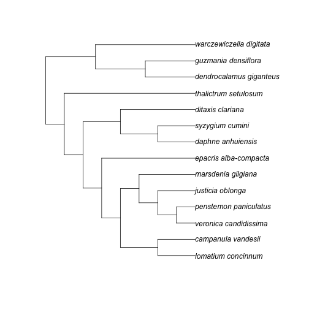

phylocomr
=========


[](https://cranchecks.info/pkgs/phylocomr)
[](https://travis-ci.org/ropensci/phylocomr)
[](https://ci.appveyor.com/project/jeroen/phylocomr)
[](https://codecov.io/gh/ropensci/phylocomr)
[](https://github.com/metacran/cranlogs.app)
[](https://cran.r-project.org/package=phylocomr)

`phylocomr` gives you access to the [Phylocom C library](https://github.com/phylocom/phylocom/).

## Package API

* `ecovolve`/`ph_ecovolve` - interface to `ecovolve` executable, and a higher
level interface
* `phylomatic`/`ph_phylomatic` - interface to `phylomatic` executable, and a higher
level interface
* `phylocom` - interface to `phylocom` executable
* `ph_aot` - higher level interface to `aot`
* `ph_bladj` - higher level interface to `bladj`
* `ph_comdist`/`ph_comdistnt` - higher level interface to comdist
* `ph_comstruct` - higher level interface to comstruct
* `ph_comtrait` - higher level interface to comtrait
* `ph_pd` - higher level interface to Faith's phylogenetic diversity

## Installation

Stable version:


```r
install.packages("phylocomr")
```

Development version:


```r
remotes::install_github("ropensci/phylocomr")
```


```r
library("phylocomr")
library("phytools")
library("ape")
```

## ecovolve


```r
ph_ecovolve(speciation = 0.05, extinction = 0.005, time_units = 50)
```

```
#> $phylogeny
#> [1] "(((((dead8:3.000000,(sp42:29.000000,((sp47:15.000000,(sp60:5.000000,(sp71:1.000000,sp72:1.000000)node38:4.000000)node31:10.000000)node21:11.000000,((sp52:11.000000,sp53:11.000000)node25:8.000000,(sp64:3.000000,sp65:3.000000)node34:16.000000)node17:7.000000)node11:3.000000)node10:5.000000)node7:7.000000,(dead15:3.000000,(sp43:23.000000,(sp49:14.000000,(sp54:11.000000,sp55:11.000000)node26:3.000000)node23:9.000000)node13:1.000000)node12:17.000000)node3:1.000000,((((dead29:12.000000,(sp59:5.000000,(sp66:3.000000,(sp73:1.000000,sp74:1.000000)node39:2.000000)node35:2.000000)node30:13.000000)node19:1.000000,(sp69:1.000000,sp70:1.000000)node37:18.000000)node18:2.000000,sp44:21.000000)node14:19.000000,(sp40:36.000000,(sp50:13.000000,sp51:13.000000)node24:23.000000)node6:4.000000)node4:2.000000)node2:2.000000,((sp45:17.000000,sp46:17.000000)node20:21.000000,((sp48:15.000000,(sp57:8.000000,sp58:8.000000)node28:7.000000)node22:4.000000,(sp56:9.000000,(sp61:5.000000,sp62:5.000000)node32:4.000000)node27:10.000000)node16:19.000000)node5:6.000000)node1:6.000000,(sp41:29.000000,(sp63:4.000000,(sp67:3.000000,sp68:3.000000)node36:1.000000)node33:25.000000)node9:21.000000)node0:0.000000;\n"
#> 
#> $sample
#> # A tibble: 35 x 3
#>    sample abundance name 
#>    <chr>      <int> <chr>
#>  1 alive          1 sp40 
#>  2 alive          1 sp41 
#>  3 alive          1 sp42 
#>  4 alive          1 sp43 
#>  5 alive          1 sp44 
#>  6 alive          1 sp45 
#>  7 alive          1 sp46 
#>  8 alive          1 sp47 
#>  9 alive          1 sp48 
#> 10 alive          1 sp49 
#> # ... with 25 more rows
#> 
#> $traits
#> # A tibble: 38 x 6
#>    name   ecov0 ecov1 ecov2 ecov3 ecov4
#>    <chr>  <dbl> <dbl> <dbl> <dbl> <dbl>
#>  1 dead8     -5     4     1   -14    -8
#>  2 dead15   -11    -8   -13    -3    13
#>  3 dead29    21   -22    24     3     2
#>  4 sp40       0    -5     8     0    11
#>  5 sp41     -11    17    16    -1   -11
#>  6 sp42     -19   -10     5    -6   -12
#>  7 sp43      10    -3    11    14     3
#>  8 sp44      14   -16    21     9     2
#>  9 sp45       1     8     2   -25    11
#> 10 sp46       2    16     3    -6    14
#> # ... with 28 more rows
```

## phylomatic


```r
taxa_file <- system.file("examples/taxa", package = "phylocomr")
phylo_file <- system.file("examples/phylo", package = "phylocomr")
(taxa_str <- readLines(taxa_file))
```

```
#> [1] "campanulaceae/lobelia/lobelia_conferta"          
#> [2] "cyperaceae/mapania/mapania_africana"             
#> [3] "amaryllidaceae/narcissus/narcissus_cuatrecasasii"
```

```r
(phylo_str <- readLines(phylo_file))
```

```
#> [1] "(((((eliea_articulata,homalanthus_populneus)malpighiales,rosa_willmottiae),((macrocentrum_neblinae,qualea_clavata),hibiscus_pohlii)malvids),(((lobelia_conferta,((millotia_depauperata,(layia_chrysanthemoides,layia_pentachaeta)layia),senecio_flanaganii)asteraceae)asterales,schwenkia_americana),tapinanthus_buntingii)),(narcissus_cuatrecasasii,mapania_africana))poales_to_asterales;"
```

```r
ph_phylomatic(taxa = taxa_str, phylo = phylo_str)
```

```
#> [1] "(lobelia_conferta:5.000000,(mapania_africana:1.000000,narcissus_cuatrecasasii:1.000000):1.000000)poales_to_asterales;\n"
#> attr(,"taxa_file")
#> [1] "/var/folders/fc/n7g_vrvn0sx_st0p8lxb3ts40000gn/T//RtmpVcH2jI/taxa_17a4c712d3092"
#> attr(,"phylo_file")
#> [1] "/var/folders/fc/n7g_vrvn0sx_st0p8lxb3ts40000gn/T//RtmpVcH2jI/phylo_17a4c4dcffb4a"
```

## aot


```r
traits_file <- system.file("examples/traits_aot", package = "phylocomr")
phylo_file <- system.file("examples/phylo_aot", package = "phylocomr")
traitsdf_file <- system.file("examples/traits_aot_df", package = "phylocomr")
traits <- read.table(text = readLines(traitsdf_file), header = TRUE,
  stringsAsFactors = FALSE)
phylo_str <- readLines(phylo_file)
ph_aot(traits = traits, phylo = phylo_str)
```

```
#> $trait_conservatism
#> # A tibble: 124 x 28
#>    trait trait.name  node name    age ntaxa n.nodes tip.mn tmn.ranklow
#>    <int> <chr>      <int> <chr> <dbl> <int>   <int>  <dbl>       <int>
#>  1     1 traitA         0 A         5    32       2   1.75        1000
#>  2     1 traitA         1 B         4    16       2   1.75         678
#>  3     1 traitA         2 C         3     8       2   1.75         695
#>  4     1 traitA         3 D         2     4       2   1.5          285
#>  5     1 traitA         4 E         1     2       2   1             68
#>  6     1 traitA         7 F         1     2       2   2           1000
#>  7     1 traitA        10 G         2     4       2   2           1000
#>  8     1 traitA        11 H         1     2       2   2           1000
#>  9     1 traitA        14 I         1     2       2   2           1000
#> 10     1 traitA        17 J         3     8       2   1.75         653
#> # ... with 114 more rows, and 19 more variables: tmn.rankhi <int>,
#> #   tip.sd <dbl>, tsd.ranklow <int>, tsd.rankhi <int>, node.mn <dbl>,
#> #   nmn.ranklow <int>, nmn.rankhi <int>, nod.sd <dbl>, nsd.ranklow <int>,
#> #   nsd.rankhi <int>, sstipsroot <dbl>, sstips <dbl>,
#> #   percvaramongnodes <dbl>, percvaratnode <dbl>, contributionindex <dbl>,
#> #   sstipvnoderoot <dbl>, sstipvnode <dbl>, ssamongnodes <dbl>,
#> #   sswithinnodes <dbl>
#> 
#> $independent_contrasts
#> # A tibble: 31 x 17
#>     node name    age n.nodes contrast1 contrast2 contrast3 contrast4
#>    <int> <chr> <dbl>   <int>     <dbl>     <dbl>     <dbl>     <dbl>
#>  1     0 A         5       2     0         0         0         0.254
#>  2     1 B         4       2     0         1.03      0         0.516
#>  3     2 C         3       2     0.267     0.535     0         0    
#>  4     3 D         2       2     0.577     0         1.15      0    
#>  5     4 E         1       2     0         0         0.707     0    
#>  6     7 F         1       2     0         0         0.707     0    
#>  7    10 G         2       2     0         0         1.15      0    
#>  8    11 H         1       2     0         0         0.707     0    
#>  9    14 I         1       2     0         0         0.707     0    
#> 10    17 J         3       2     0.267     0.535     0         0    
#> # ... with 21 more rows, and 9 more variables: contrastsd <dbl>,
#> #   lowval1 <dbl>, hival1 <dbl>, lowval2 <dbl>, hival2 <dbl>,
#> #   lowval3 <dbl>, hival3 <dbl>, lowval4 <dbl>, hival4 <dbl>
#> 
#> $phylogenetic_signal
#> # A tibble: 4 x 5
#>   trait  ntaxa varcontr varcn.ranklow varcn.rankhi
#>   <chr>  <int>    <dbl>         <int>        <int>
#> 1 traitA    32    0.054             1         1000
#> 2 traitB    32    0.109             1         1000
#> 3 traitC    32    0.622            67          934
#> 4 traitD    32    0.011             1         1000
#> 
#> $ind_contrast_corr
#> # A tibble: 3 x 6
#>   xtrait ytrait ntaxa  picr  npos ncont
#>   <chr>  <chr>  <int> <dbl> <dbl> <int>
#> 1 traitA traitB    32 0.248  18.5    31
#> 2 traitA traitC    32 0.485  27.5    31
#> 3 traitA traitD    32 0      16.5    31
```

## bladj


```r
ages_file <- system.file("examples/ages", package = "phylocomr")
phylo_file <- system.file("examples/phylo_bladj", package = "phylocomr")
ages_df <- data.frame(
  a = c('malpighiales','salicaceae','fabaceae','rosales','oleaceae',
        'gentianales','apocynaceae','rubiaceae'),
  b = c(81,20,56,76,47,71,18,56)
)
phylo_str <- readLines(phylo_file)
(res <- ph_bladj(ages = ages_df, phylo = phylo_str))
```

```
#> [1] "((((((lomatium_concinnum:20.250000,campanula_vandesii:20.250000):20.250000,(((veronica_candidissima:10.125000,penstemon_paniculatus:10.125000)plantaginaceae:10.125000,justicia_oblonga:20.250000):10.125000,marsdenia_gilgiana:30.375000):10.125000):10.125000,epacris_alba-compacta:50.625000)ericales_to_asterales:10.125000,((daphne_anhuiensis:20.250000,syzygium_cumini:20.250000)malvids:20.250000,ditaxis_clariana:40.500000):20.250000):10.125000,thalictrum_setulosum:70.875000)eudicots:10.125000,((dendrocalamus_giganteus:27.000000,guzmania_densiflora:27.000000)poales:27.000000,warczewiczella_digitata:54.000000):27.000000)malpighiales:1.000000;\n"
#> attr(,"ages_file")
#> [1] "/var/folders/fc/n7g_vrvn0sx_st0p8lxb3ts40000gn/T//RtmpVcH2jI/ages"
#> attr(,"phylo_file")
#> [1] "/var/folders/fc/n7g_vrvn0sx_st0p8lxb3ts40000gn/T//RtmpVcH2jI/phylo_17a4c1ade3840"
```

```r
plot(phytools::read.newick(text = res))
```



## Meta

* Please [report any issues or bugs](https://github.com/ropensci/phylocomr/issues).
* License: MIT
* Get citation information for `phylocomr` in R doing `citation(package = 'phylocomr')`
* Please note that this project is released with a [Contributor Code of Conduct](CODE_OF_CONDUCT.md). By participating in this project you agree to abide by its terms.

[](https://ropensci.org)
