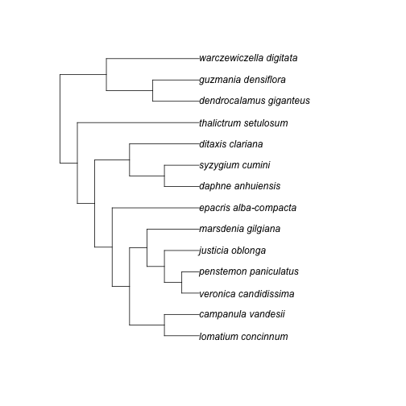

phylocomr
=========


[](https://www.repostatus.org/#active)
[](https://travis-ci.org/ropensci/phylocomr)
[](https://ci.appveyor.com/project/jeroen/phylocomr)
[](https://cranchecks.info/pkgs/phylocomr)
[](https://codecov.io/gh/ropensci/phylocomr)
[](https://github.com/metacran/cranlogs.app)
[](https://cran.r-project.org/package=phylocomr)

`phylocomr` gives you access to the [Phylocom C library](https://github.com/phylocom/phylocom/), licensed under [BSD 2-clause](http://www.opensource.org/licenses/bsd-license.php)

## Package API

* `ecovolve`/`ph_ecovolve` - interface to `ecovolve` executable, and a higher
level interface
* `phylomatic`/`ph_phylomatic` - interface to `phylomatic` executable, and a higher
level interface
* `phylocom` - interface to `phylocom` executable
* `ph_aot` - higher level interface to `aot`
* `ph_bladj` - higher level interface to `bladj`
* `ph_comdist`/`ph_comdistnt` - higher level interface to comdist
* `ph_comstruct` - higher level interface to comstruct
* `ph_comtrait` - higher level interface to comtrait
* `ph_pd` - higher level interface to Faith's phylogenetic diversity

## Installation

Stable version:


```r
install.packages("phylocomr")
```

Development version:


```r
remotes::install_github("ropensci/phylocomr")
```


```r
library("phylocomr")
library("ape")
```

## ecovolve


```r
ph_ecovolve(speciation = 0.05, extinction = 0.005, time_units = 50)
```

## phylomatic


```r
taxa_file <- system.file("examples/taxa", package = "phylocomr")
phylo_file <- system.file("examples/phylo", package = "phylocomr")
(taxa_str <- readLines(taxa_file))
```

```
#> [1] "campanulaceae/lobelia/lobelia_conferta"          
#> [2] "cyperaceae/mapania/mapania_africana"             
#> [3] "amaryllidaceae/narcissus/narcissus_cuatrecasasii"
```

```r
(phylo_str <- readLines(phylo_file))
```

```
#> [1] "(((((eliea_articulata,homalanthus_populneus)malpighiales,rosa_willmottiae),((macrocentrum_neblinae,qualea_clavata),hibiscus_pohlii)malvids),(((lobelia_conferta,((millotia_depauperata,(layia_chrysanthemoides,layia_pentachaeta)layia),senecio_flanaganii)asteraceae)asterales,schwenkia_americana),tapinanthus_buntingii)),(narcissus_cuatrecasasii,mapania_africana))poales_to_asterales;"
```

```r
ph_phylomatic(taxa = taxa_str, phylo = phylo_str)
```

```
#> [1] "(lobelia_conferta:5.000000,(mapania_africana:1.000000,narcissus_cuatrecasasii:1.000000):1.000000)poales_to_asterales;\n"
#> attr(,"taxa_file")
#> [1] "/var/folders/fc/n7g_vrvn0sx_st0p8lxb3ts40000gn/T//RtmphPGENV/taxa_a56d435c046c"
#> attr(,"phylo_file")
#> [1] "/var/folders/fc/n7g_vrvn0sx_st0p8lxb3ts40000gn/T//RtmphPGENV/phylo_a56d4e267100"
```

use various different references trees


```r
library(brranching)
library(ape)

r2 <- ape::read.tree(text=brranching::phylomatic_trees[['R20120829']])
smith2011 <- ape::read.tree(text=brranching::phylomatic_trees[['smith2011']])
zanne2014 <- ape::read.tree(text=brranching::phylomatic_trees[['zanne2014']])

# R20120829 tree
taxa_str <- c(
  "asteraceae/bidens/bidens_alba",
  "asteraceae/cirsium/cirsium_arvense",
  "fabaceae/lupinus/lupinus_albus"
)
ph_phylomatic(taxa = taxa_str, phylo = r2)
```

```
#> [1] "(((bidens_alba:13.000000,cirsium_arvense:13.000000):19.000000,lupinus_albus:27.000000):12.000000)euphyllophyte;\n"
#> attr(,"taxa_file")
#> [1] "/var/folders/fc/n7g_vrvn0sx_st0p8lxb3ts40000gn/T//RtmphPGENV/taxa_a56d4811fb61"
#> attr(,"phylo_file")
#> [1] "/var/folders/fc/n7g_vrvn0sx_st0p8lxb3ts40000gn/T//RtmphPGENV/phylo_a56d148ec23e"
```

```r
# zanne2014 tree
taxa_str <- c(
  "zamiaceae/dioon/dioon_edule",
  "zamiaceae/encephalartos/encephalartos_dyerianus",
  "piperaceae/piper/piper_arboricola"
)
ph_phylomatic(taxa = taxa_str, phylo = zanne2014)
```

```
#> [1] "(((dioon_edule:121.744843,encephalartos_dyerianus:121.744850)zamiaceae:230.489838,piper_arboricola:352.234711)spermatophyta:88.058670);\n"
#> attr(,"taxa_file")
#> [1] "/var/folders/fc/n7g_vrvn0sx_st0p8lxb3ts40000gn/T//RtmphPGENV/taxa_a56d28727efd"
#> attr(,"phylo_file")
#> [1] "/var/folders/fc/n7g_vrvn0sx_st0p8lxb3ts40000gn/T//RtmphPGENV/phylo_a56d74ef28c9"
```

```r
# zanne2014 subtree
zanne2014_subtr <- ape::extract.clade(zanne2014, node='Loganiaceae')
zanne_subtree_file <- tempfile(fileext = ".txt")
ape::write.tree(zanne2014_subtr, file = zanne_subtree_file)
taxa_str <- c(
  "loganiaceae/neuburgia/neuburgia_corynocarpum",
  "loganiaceae/geniostoma/geniostoma_borbonicum",
  "loganiaceae/strychnos/strychnos_darienensis"
)
ph_phylomatic(taxa = taxa_str, phylo = zanne2014_subtr)
```

```
#> [1] "((neuburgia_corynocarpum:32.807743,(geniostoma_borbonicum:32.036335,strychnos_darienensis:32.036335):0.771406):1.635496)loganiaceae;\n"
#> attr(,"taxa_file")
#> [1] "/var/folders/fc/n7g_vrvn0sx_st0p8lxb3ts40000gn/T//RtmphPGENV/taxa_a56d7bca8a02"
#> attr(,"phylo_file")
#> [1] "/var/folders/fc/n7g_vrvn0sx_st0p8lxb3ts40000gn/T//RtmphPGENV/phylo_a56d2e2ac8cc"
```

```r
ph_phylomatic(taxa = taxa_str, phylo = zanne_subtree_file)
```

```
#> [1] "((neuburgia_corynocarpum:32.807743,(geniostoma_borbonicum:32.036335,strychnos_darienensis:32.036335):0.771406):1.635496)loganiaceae;\n"
#> attr(,"taxa_file")
#> [1] "/var/folders/fc/n7g_vrvn0sx_st0p8lxb3ts40000gn/T//RtmphPGENV/taxa_a56d7ae4e0c1"
#> attr(,"phylo_file")
#> [1] "/var/folders/fc/n7g_vrvn0sx_st0p8lxb3ts40000gn/T//RtmphPGENV/filea56d15ee019.txt"
```

## aot


```r
traits_file <- system.file("examples/traits_aot", package = "phylocomr")
phylo_file <- system.file("examples/phylo_aot", package = "phylocomr")
traitsdf_file <- system.file("examples/traits_aot_df", package = "phylocomr")
traits <- read.table(text = readLines(traitsdf_file), header = TRUE,
  stringsAsFactors = FALSE)
phylo_str <- readLines(phylo_file)
ph_aot(traits = traits, phylo = phylo_str)
```

```
#> $trait_conservatism
#> # A tibble: 124 x 28
#>    trait trait.name  node name    age ntaxa n.nodes tip.mn tmn.ranklow
#>    <int> <chr>      <int> <chr> <dbl> <int>   <int>  <dbl>       <int>
#>  1     1 traitA         0 a         5    32       2   1.75        1000
#>  2     1 traitA         1 b         4    16       2   1.75         667
#>  3     1 traitA         2 c         3     8       2   1.75         668
#>  4     1 traitA         3 d         2     4       2   1.5          255
#>  5     1 traitA         4 e         1     2       2   1             53
#>  6     1 traitA         7 f         1     2       2   2           1000
#>  7     1 traitA        10 g         2     4       2   2           1000
#>  8     1 traitA        11 h         1     2       2   2           1000
#>  9     1 traitA        14 i         1     2       2   2           1000
#> 10     1 traitA        17 j         3     8       2   1.75         675
#> # … with 114 more rows, and 19 more variables: tmn.rankhi <int>,
#> #   tip.sd <dbl>, tsd.ranklow <int>, tsd.rankhi <int>, node.mn <dbl>,
#> #   nmn.ranklow <int>, nmn.rankhi <int>, nod.sd <dbl>, nsd.ranklow <int>,
#> #   nsd.rankhi <int>, sstipsroot <dbl>, sstips <dbl>,
#> #   percvaramongnodes <dbl>, percvaratnode <dbl>, contributionindex <dbl>,
#> #   sstipvnoderoot <dbl>, sstipvnode <dbl>, ssamongnodes <dbl>,
#> #   sswithinnodes <dbl>
#> 
#> $independent_contrasts
#> # A tibble: 31 x 17
#>     node name    age n.nodes contrast1 contrast2 contrast3 contrast4
#>    <int> <chr> <dbl>   <int>     <dbl>     <dbl>     <dbl>     <dbl>
#>  1     0 a         5       2     0         0         0         0.254
#>  2     1 b         4       2     0         1.03      0         0.516
#>  3     2 c         3       2     0.267     0.535     0         0    
#>  4     3 d         2       2     0.577     0         1.15      0    
#>  5     4 e         1       2     0         0         0.707     0    
#>  6     7 f         1       2     0         0         0.707     0    
#>  7    10 g         2       2     0         0         1.15      0    
#>  8    11 h         1       2     0         0         0.707     0    
#>  9    14 i         1       2     0         0         0.707     0    
#> 10    17 j         3       2     0.267     0.535     0         0    
#> # … with 21 more rows, and 9 more variables: contrastsd <dbl>,
#> #   lowval1 <dbl>, hival1 <dbl>, lowval2 <dbl>, hival2 <dbl>,
#> #   lowval3 <dbl>, hival3 <dbl>, lowval4 <dbl>, hival4 <dbl>
#> 
#> $phylogenetic_signal
#> # A tibble: 4 x 5
#>   trait  ntaxa varcontr varcn.ranklow varcn.rankhi
#>   <chr>  <int>    <dbl>         <int>        <int>
#> 1 traitA    32    0.054             2          999
#> 2 traitB    32    0.109             1         1000
#> 3 traitC    32    0.622            56          945
#> 4 traitD    32    0.011             1         1000
#> 
#> $ind_contrast_corr
#> # A tibble: 3 x 6
#>   xtrait ytrait ntaxa  picr  npos ncont
#>   <chr>  <chr>  <int> <dbl> <dbl> <int>
#> 1 traitA traitB    32 0.248  18.5    31
#> 2 traitA traitC    32 0.485  27.5    31
#> 3 traitA traitD    32 0      16.5    31
```

## bladj


```r
ages_file <- system.file("examples/ages", package = "phylocomr")
phylo_file <- system.file("examples/phylo_bladj", package = "phylocomr")
ages_df <- data.frame(
  a = c('malpighiales','salicaceae','fabaceae','rosales','oleaceae',
        'gentianales','apocynaceae','rubiaceae'),
  b = c(81,20,56,76,47,71,18,56)
)
phylo_str <- readLines(phylo_file)
(res <- ph_bladj(ages = ages_df, phylo = phylo_str))
```

```
#> [1] "((((((lomatium_concinnum:20.250000,campanula_vandesii:20.250000):20.250000,(((veronica_candidissima:10.125000,penstemon_paniculatus:10.125000)plantaginaceae:10.125000,justicia_oblonga:20.250000):10.125000,marsdenia_gilgiana:30.375000):10.125000):10.125000,epacris_alba-compacta:50.625000)ericales_to_asterales:10.125000,((daphne_anhuiensis:20.250000,syzygium_cumini:20.250000)malvids:20.250000,ditaxis_clariana:40.500000):20.250000):10.125000,thalictrum_setulosum:70.875000)eudicots:10.125000,((dendrocalamus_giganteus:27.000000,guzmania_densiflora:27.000000)poales:27.000000,warczewiczella_digitata:54.000000):27.000000)malpighiales:1.000000;\n"
#> attr(,"ages_file")
#> [1] "/var/folders/fc/n7g_vrvn0sx_st0p8lxb3ts40000gn/T//RtmphPGENV/ages"
#> attr(,"phylo_file")
#> [1] "/var/folders/fc/n7g_vrvn0sx_st0p8lxb3ts40000gn/T//RtmphPGENV/phylo_a56df4e6c37"
```

```r
plot(ape::read.tree(text = res))
```



## Meta

* Please [report any issues or bugs](https://github.com/ropensci/phylocomr/issues).
* License: MIT
* Get citation information for `phylocomr` in R doing `citation(package = 'phylocomr')`
* Please note that this project is released with a [Contributor Code of Conduct][coc].
By participating in this project you agree to abide by its terms.

[](https://ropensci.org)

[coc]: https://github.com/ropensci/phylocomr/blob/master/CODE_OF_CONDUCT.md
